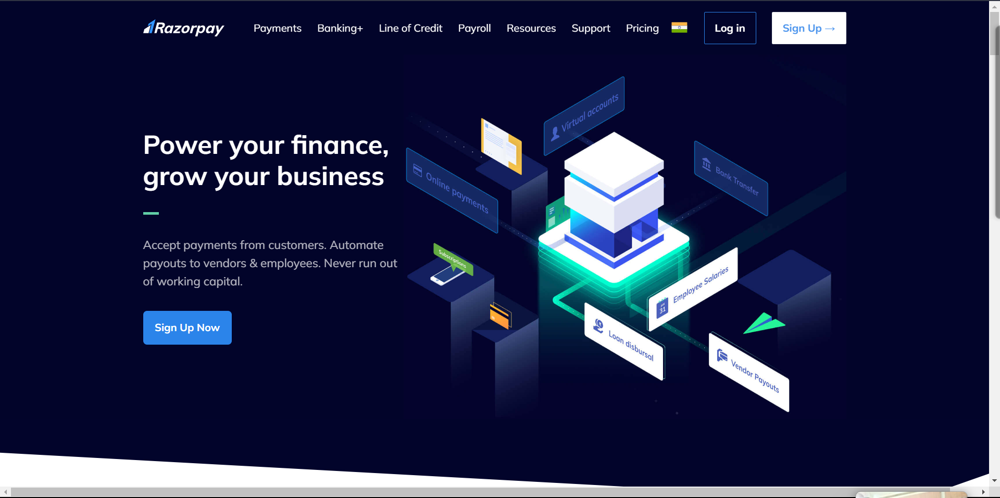
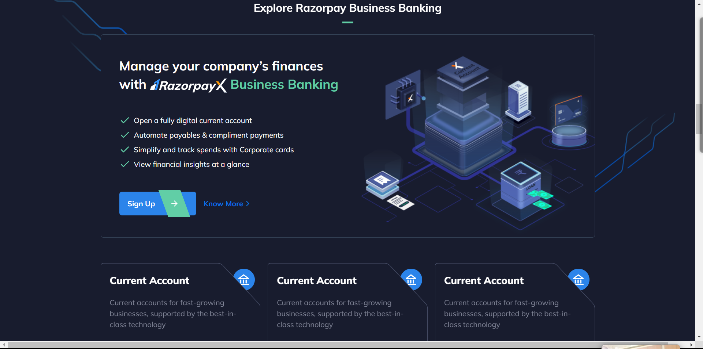

# Razorpay Clone Project
This project is a front-end clone of the Razorpay website, created using HTML and Tailwind CSS. It replicates the core features section of the Razorpay website, including the layout and design.

### Razorpay Clone Screenshot:

### Demo
You can view a live demo of this project here :https://rrazorpay.netlify.app/

### Features
1. Cloned the core features section of the Razorpay website.
2. Implemented a responsive design using Tailwind CSS.
3. Added testimonials and a call-to-action section.
4. Used Feather Icons for icons.

### Prerequisites
Before you begin, ensure you have met the following requirements:

Node.js and npm installed on your system.
Installation
To install and run this project locally, follow these steps:
Clone the repository: git clone https://github.com/soulistic/razorpay-clone.git
Change to the project directory: cd razorpay-clone
Install dependencies: npm install
### Usage
To run this project locally, follow these steps:

Start the development server:npm run dev
Open your web browser and navigate to http://localhost:3000 to view the project.

### Technologies Used
This project was built using the following technologies:

1.HTML
2. Tailwind CSS
3. Feather Icons

### Contributing
If you would like to contribute to this project, follow these steps:

1. Fork the project.
2. Create a new branch for your feature or bugfix: git checkout -b feature/new-feature.
3. Commit your changes and push to your fork: git push origin feature/new-feature.
4. Open a pull request on the original repository.

### License
This project is licensed under the MIT License.